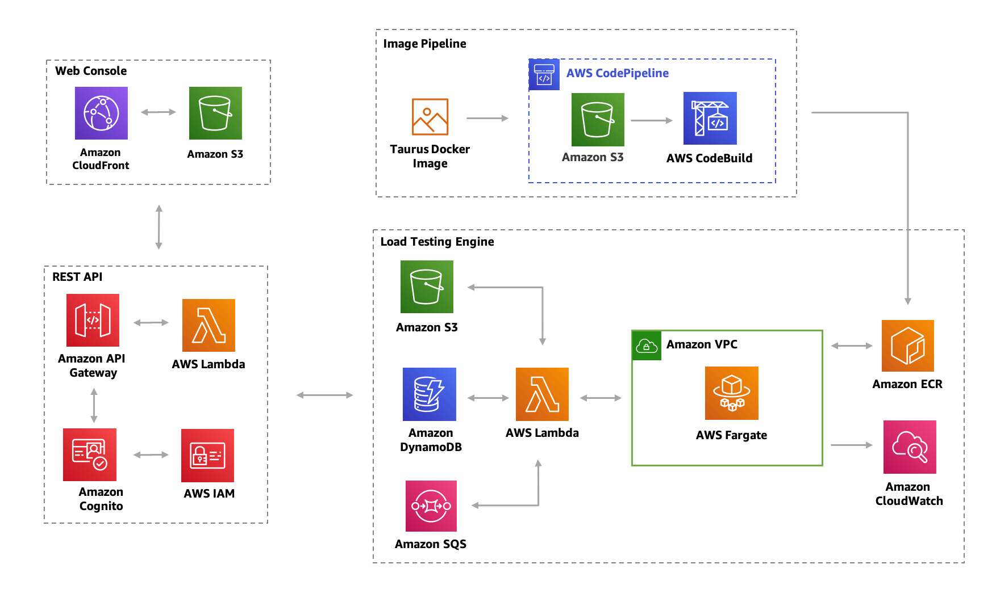

# Overview
The crux of the solution was taken from the [Distributed Load Testing on AWS](https://aws.amazon.com/solutions/distributed-load-testing-on-aws/) design. For the most part the design pattern is solid however after actually using it, it's implementation of the Taurus load testing engine (Which is based on jMeter)... it was rather limited, slow and results from those tests took a long time to generate. In addition it's been converted from CloudFormation to Terraform.

What I've done is take the core concept of the solution, re-write the [React](https://reactjs.org/) frontend and the backend API along with some of the core design concepts and expanded on them in certain areas to turn it in to a kind of framework to support multiple different engines (If required in the future) as well as give the console some additional functionality (Mainly around pricing and sizing of the fargate containers).

## Architecture
* Architecture design is still accurate just ignore the mention of a of a specific docker image




# Load testing engines
* Locust
    * https://locust.io/
    * Python based distributed load testing tool
    * Comes with it's own frontend once spun up and gives realtime monitoring of the load test along with the ability to write custom scenarios for testing (Logins, path based testing etc)
    * Writing a locust file documentation
        * https://docs.locust.io/en/stable/writing-a-locustfile.html

# Usage
Given this is designed to be run ADHOC when required it will require configuring your AWS CLI with a profile that has sufficient permissions to create the resources required

## Creation
* Ensure you have the version of terraform installed defined [here](#Requirements)
* Ensure you have the AWS CLI installed
    * Can be downloaded from [here](https://aws.amazon.com/cli/)
* Clone this repo
* Login to the AWS account where this is going to be run from and create an IAM user with sufficient permissions to create the resources required and create some programmatic access keys
    * Minimum IAM permissions policy to create everything required in this solution can be found [here](least_permissions_policy.json)
* Configure the AWS CLI
    * Configure the default profile
        * ```aws configure```
    * Configure AWS CLI with a profile
        * ```aws confgiure --profile <profile-name>```
        * Replace ```<profile-name>``` with what you want the profile to be called
* If you elected to create a separate profile in the step before this add the profile name to the vars file [here](vars.tf#L79)
* If you are working from outside of the office network you will need to add your IPv4 address to the allowed list of IP's otherwise the WAF will block access
    * You can find your IPv4 address [here](https://lmgtfy.com/?q=what+is+my+ip+address)
    * Once you have your IPv4 add a new config block to [here](vars.tf#L38)
    * If you don't do this and you try and access the CloudFront distribution URL you'll get a miselading blank page. This is because it's a React SPA so all 404 & 403 responses are being redirected back to the index.html with a 200 status code so even when you get a 403 it'll think it's a 200
* From the command line run ```terraform apply```
* It will prompt you for your email address input it and press enter
* Type in ```yes``` once the plan output is complete and terraform will begin deploying the solution

Once terraform has spun up the resources the email account which was defined in the only required variable will be sent an email with the default user (Which defaults to __*Admin*__), a randomly generated password for that user and the CloudFront distribution URL.

* In the background Codepipeline and Codebuild will be working on building and deploying the console, containers images and scenarios to where they are meant to be so give that entire process about 5-10 minutes before you try and access the console
* Access to the both the DLT console and the Locust swarm console are limited to what's configured for the WAF (Both IP whitelist and geo)

## Destruction
* Once you've deleted the engine from the console you can then safely tear down the load testing tool by running the following from the command line
    * ```terraform destroy```
        * Say ```yes``` at the end of the destruction output
        * Sometimes you may need to run this more than once

# Requirements

* AWS CLI
    * There is one task as part of this process that creates the initial Cognito User and there isn't a Terraform resource for that so the AWS CLI is being used which means you need to have permissions to run
    ```aws cognito-idp admin-create-user```

| Name | Version |
|------|---------|
| <a name="requirement_terraform"></a> [terraform](#requirement\_terraform) | >= 0.12.4 |

## Providers

| Name | Version |
|------|---------|
| <a name="provider_aws"></a> [aws](#provider\_aws) | n/a |

## Modules

| Name | Source | Version |
|------|--------|---------|
| <a name="module_backend"></a> [backend](#module\_backend) | ./modules/backend | n/a |
| <a name="module_frontend"></a> [frontend](#module\_frontend) | ./modules/frontend | n/a |

## Resources

| Name | Type |
|------|------|
| [aws_kms_alias.this](https://registry.terraform.io/providers/hashicorp/aws/latest/docs/resources/kms_alias) | resource |
| [aws_kms_key.this](https://registry.terraform.io/providers/hashicorp/aws/latest/docs/resources/kms_key) | resource |
| [aws_caller_identity.current](https://registry.terraform.io/providers/hashicorp/aws/latest/docs/data-sources/caller_identity) | data source |

## Inputs

| Name | Description | Type | Default | Required |
|------|-------------|------|---------|:--------:|
| <a name="input_aws_cli_profile_name"></a> [aws\_cli\_profile\_name](#input\_aws\_cli\_profile\_name) | AWS CLI profile to use for credentials if not using the default | `string` | `""` | no |
| <a name="input_geo_loc_whitelist"></a> [geo\_loc\_whitelist](#input\_geo\_loc\_whitelist) | List of countries to whitelist | `list(string)` | <pre>[<br>  "AU"<br>]</pre> | no |
| <a name="input_initial_admin_account_name"></a> [initial\_admin\_account\_name](#input\_initial\_admin\_account\_name) | Default admin username for initial login to Cognito | `string` | `"Admin"` | no |
| <a name="input_initial_admin_email_address"></a> [initial\_admin\_email\_address](#input\_initial\_admin\_email\_address) | Default email address for initial login to Cognito. Initial login details will be sent here | `string` | n/a | yes |
| <a name="input_name"></a> [name](#input\_name) | Name of the solution | `string` | `"DistributedLoadTesting"` | no |
| <a name="input_public_ips_for_slaves"></a> [public\_ips\_for\_slaves](#input\_public\_ips\_for\_slaves) | Flag for weather or not to assign public IP's to slaves. This will give that each slave is coming from a different IP address as opposed to routing traffic out of the 3 known NAT gateways | `bool` | `false` | no |
| <a name="input_vpc_cidr"></a> [vpc\_cidr](#input\_vpc\_cidr) | CIDR for the VPC | `string` | `"192.168.0.0/16"` | no |
| <a name="input_vpc_private_subnet_cidrs"></a> [vpc\_private\_subnet\_cidrs](#input\_vpc\_private\_subnet\_cidrs) | List of CIDRs to be used for private subnets | `list` | <pre>[<br>  "192.168.4.0/24",<br>  "192.168.5.0/24",<br>  "192.168.6.0/24"<br>]</pre> | no |
| <a name="input_vpc_public_subnet_cidrs"></a> [vpc\_public\_subnet\_cidrs](#input\_vpc\_public\_subnet\_cidrs) | List of CIDRs to be used for public subnets | `list` | <pre>[<br>  "192.168.1.0/24",<br>  "192.168.2.0/24",<br>  "192.168.3.0/24"<br>]</pre> | no |

## Outputs

| Name | Description |
|------|-------------|
| <a name="output_nat_ip_addresses"></a> [nat\_ip\_addresses](#output\_nat\_ip\_addresses) | List of public IP addresses assigned to the NAT gateways |
